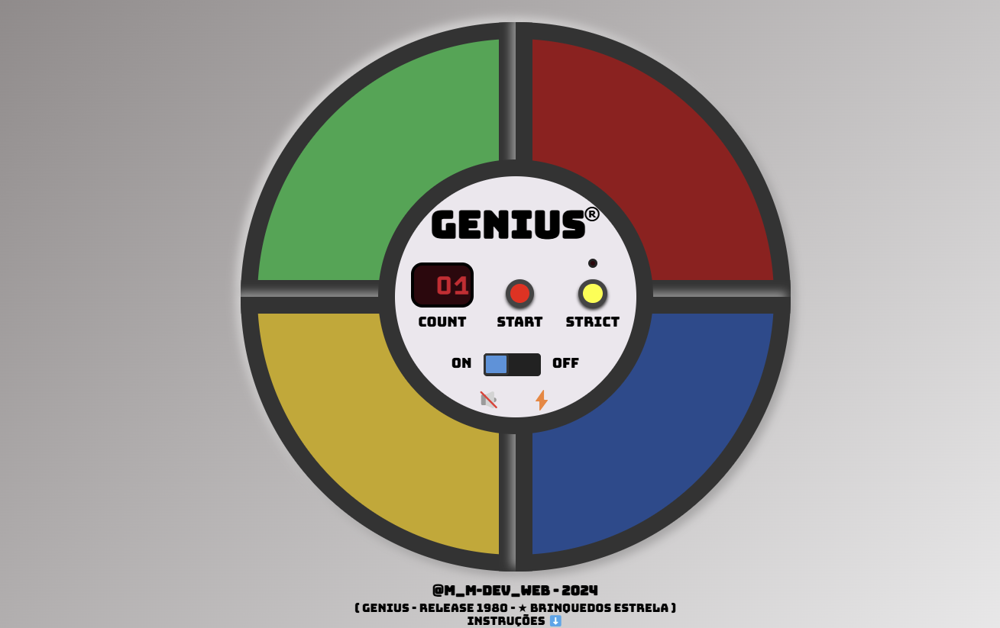
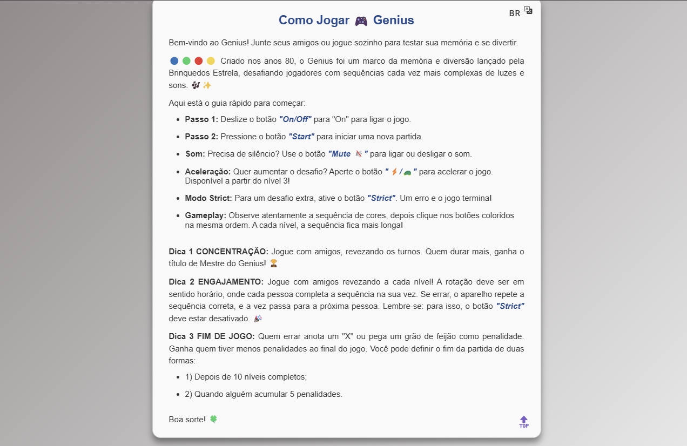
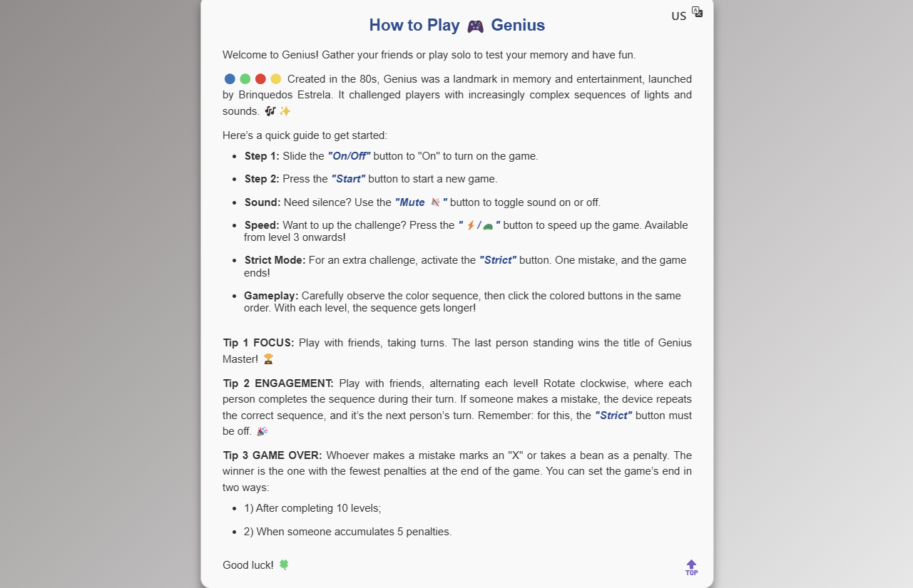
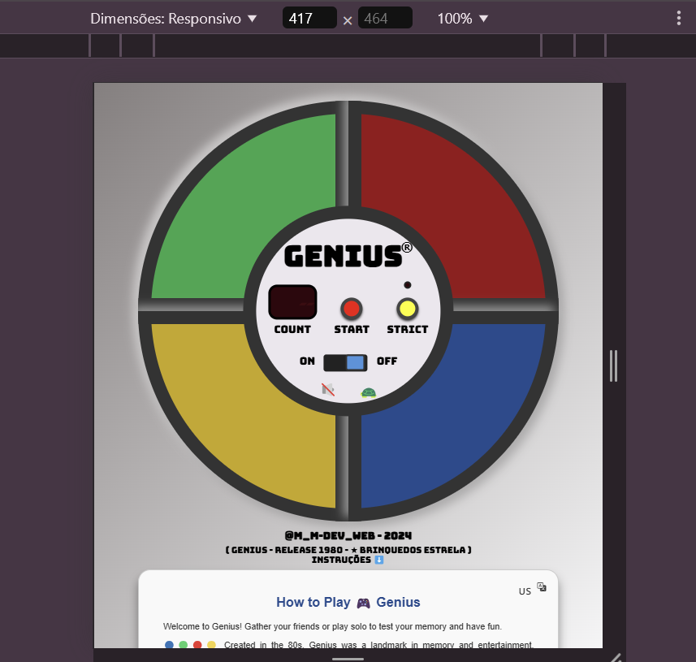
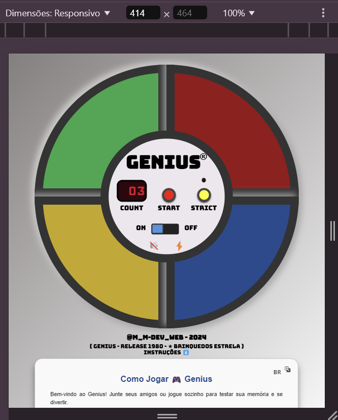

# Portfolio_Proj_001-Game_Genius_1980
Portfolio_Proj_001-Game_Genius_1980

# Nome do Projeto
Game GENIUS - Brinquedos Estrela - Lançamento 1980

🔵🟢🔴🟡 Criado nos anos 80, o Genius foi um marco da memória e diversão lançado pela Brinquedos Estrela, desafiando jogadores com sequências cada vez mais complexas de luzes e sons. 🎶✨

# Link do Projeto Finalizado:

☑️ Projeto finalizado / Deploy no GitHub Pages: https://marcia-moreira.github.io/Portfolio_Proj_001-Game_Genius_1980/

## Funcionalidades
- 🎮 Reprodução de sequência de cores: O jogo exibe uma sequência aleatória de cores que o jogador precisa memorizar e repetir na mesma ordem.
- ⏱️ Aumento de dificuldade progressivo: A cada rodada, uma nova cor é adicionada à sequência, tornando o jogo mais desafiador.
- ⚡ Velocidade gradativa (opcional): O jogador pode ativar um modo onde a velocidade de exibição das cores aumenta progressivamente, dificultando ainda mais a memorização.
- ✅ Verificação de acertos: O jogo compara a sequência fornecida pelo jogador com a sequência gerada, determinando se ele acertou ou errou.
- 📈 Pontuação acumulada: O jogo exibe a pontuação atual com base na quantidade de rodadas concluídas.
- 🔁 Reinício do jogo: Após um erro, o jogador pode reiniciar a partida para tentar novamente.
- 🔒 Modo estrito (strict): No modo estrito, o jogo é encerrado imediatamente ao primeiro erro, desafiando ainda mais o jogador a acertar todas as sequências sem falhas.
- 🎵 Efeitos sonoros para cada botão: Cada botão emite um som específico ao ser pressionado, ajudando na memorização.
- 🖌️ Interface interativa e nostálgica: Design inspirado no jogo clássico dos anos 80, com botões coloridos e animações simples.

## Tecnologias Utilizadas
- HTML
- CSS3
- JavaScript
- Bootstrap

## Como Rodar o Projeto Localmente
1. Clone o repositório:
   ```bash
   git clone https://github.com/Marcia-Moreira/Portfolio_Proj_001-Game_Genius_1980.git

## Imagens do Projeto
<!-- -->
<div style="display: flex; justify-content: center; gap: 20px;">
   <!--  -->
   
   
   <!--  -->
   
   
   <!--  -->
   
   
   <!--  -->
   
   
   <!--  -->
   
</div>

