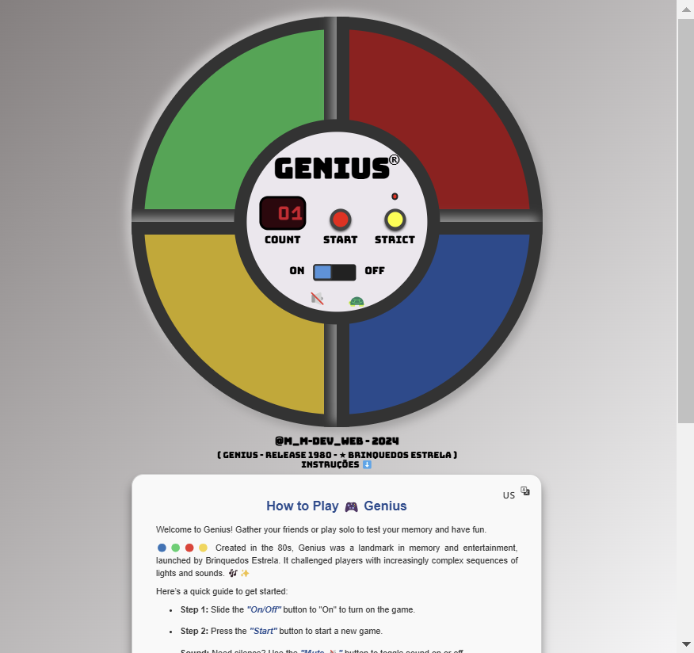

# Portfolio_Proj_001-Game_Genius_1980
  Portfolio_Proj_001-Game_Genius_1980

## Motivação para Produção deste Projeto:
Jogo reproduzido para ser usado em encontro de família em viagem de fim de ano.

## Nome do Projeto: GAME GENIUS
Game GENIUS - Brinquedos Estrela - Lançamento 1980

🔵🟢🔴🟡 Criado nos anos 80, o Genius foi um marco da memória e diversão lançado pela Brinquedos Estrela, desafiando jogadores com sequências cada vez mais complexas de luzes e sons. 🎶✨

## Link do Projeto Finalizado:
☑️ Projeto finalizado / Deploy no GitHub Pages: https://marcia-moreira.github.io/Portfolio_Proj_001-Game_Genius_1980/

## Funcionalidades Iniciais:
- 🎮 Reprodução de sequência de cores: O jogo exibe uma sequência aleatória de cores que o jogador precisa memorizar e repetir na mesma ordem.
- ⏱️ Aumento de dificuldade progressivo: A cada rodada, uma nova cor é adicionada à sequência, tornando o jogo mais desafiador.
- ✅ Verificação de acertos: O jogo compara a sequência fornecida pelo jogador com a sequência gerada, determinando se ele acertou ou errou.
- 📈 Pontuação acumulada: O jogo exibe a pontuação atual com base na quantidade de rodadas concluídas.
- 🔁 Reinício do jogo: Após um erro, o jogador pode reiniciar a partida para tentar novamente.
- 🔒 Modo estrito (strict): No modo estrito, o jogo é encerrado imediatamente ao primeiro erro, desafiando ainda mais o jogador a acertar todas as sequências sem falhas.

## Implementação de Melhorias de Funcionalidades:
- ⚡ Velocidade gradativa (opcional): O jogador pode ativar um modo onde a velocidade de exibição das cores aumenta progressivamente, dificultando ainda mais a memorização.
- 🎵 Efeitos sonoros para cada botão: Cada botão emite um som específico ao ser pressionado, ajudando na memorização.
- 🖌️ Interface interativa e nostálgica: Design inspirado no jogo clássico dos anos 80, com botões coloridos e animações simples.
- Card de Instruções.

## Tecnologias Utilizadas:

## Badges:

- **HTML5:** Estruturação do conteúdo e marcação semântica do jogo Genius.

- **CSS3:** Estilização visual com:
  - Animações para os botões interativos.
  - Transições suaves que simulam a luz dos botões.
  - Responsividade para diferentes dispositivos.

- **JavaScript (ES6):** Lógica do jogo e interação, incluindo:
  - Manipulação do DOM para destacar os botões durante as jogadas.
  - Uso de eventos para capturar cliques do jogador.
  - Implementação da lógica principal do jogo, como sequência de jogadas, verificação de erros e pontuação.
  - Implementação de lógicas complementares para controle de som e de velocidade.
  - Efeito de card 3d com frente e verso para exposição de Instruções do Jogo.

Ferramentas de apoio:
- **Git e GitHub:** Controle de versão e hospedagem do código.
- **GitHub Pages:** Para o deploy da aplicação.
- **VS Code:** Ambiente de desenvolvimento.
- **Bootstrap Icons:** Ícones navegáveis e sofisticados.
- **Trello:** Para organizar as etapas do projeto.

## Imagens do Projeto:
<!-- -->

   <!--  -->
   
   
   <!--  -->
   
   
   <!--  -->
   
   
   <!--  -->
   
   
   <!--  -->
   

   <!--  -->
   

## Links e Referências do projeto inicial:

- https://youtube.com/playlist?list=PL28O_hEAqjAtOPTlRHkHrhfmct_USCGfI&si=7A3XVJJtETKnUQmn
- https://github.com/inkasadev/genius-starter-files
- http://bit.ly/GeniusFinal
- Créditos - Canal Youtube incasadev

## Como Rodar o Projeto Localmente:
1. Clone o repositório:

   git clone https://github.com/Marcia-Moreira/Portfolio_Proj_001-Game_Genius_1980.git

## Minhas idéias de melhorias na implantação:
- ~~Delay no iniciar próxima sequencia.~~
- ~~Ao clicar ta ficando marcado o quadrado intiero e está bem feio!~~
- ~~Botar botão de tirar som?~~
- ~~Fazer oos botões/pads crescerem ao serem clicados~~
- ~~Ajustar o tamanho da marca registrada~~
- ~~Rever os margins e paddis laterais excessivos do codigo agora que está centralizado~~
- ~~Melhorar a borda do botão on/off~~
- ~~Centralizar melhor os ítens de dentro do globo central do jogo.~~
- ~~Colocar um botão/ícone de aceleração do jogo.~~
- ~~Criar setor de Instruções do Jogo (Card), com frente em Português e verso em Inglês.~~
- ~~Criar link no Nome do Jogo, na página do jogo, que leva para a página de Intruções.~~
- ~~Criar link no Rodapé do Jogo, na página do jogo, que leva para a página de Intruções.~~
- ~~Estilizar movimento para os links de página para ressaltar ação ao passar o mouse = hover.~~
- ~~Centralizar as âncoras dos link para o topo da página~~
- ~~Verificar o motivo do card estar fora de centralização horizontal da página~~
- ~~Criar condição para acelerar a mudança de cores a cada 3 níveis alcansado (front ok)~~
- ~~Ver se colocamos limites de responsividade no card de instruções~~
- Dar um padding no final do card
- Mudar as cores das teclas?
- Verificar se criamos efeito de afundar botão ao apertar!

## Registros da Construção 🧱:
- Desenvolvimento Web => **Marcia Moreira**
- Iniciado => 18/11/2024.
- Finalizado Primeiro Deploy => 26/11/2024.
- Link WhatsApp => Https://wa.me/5511977219430
